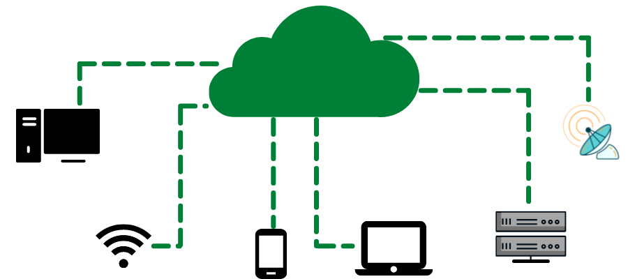

# Contaminación Ambiental: Un Desafío Global

## Introducción

La contaminación ambiental es la presencia de sustancias o elementos dañinos en el medio ambiente, que pueden ser perjudiciales para los seres humanos y los ecosistemas[^1]. Estas sustancias nocivas, conocidas como contaminantes ambientales, pueden tener diferentes orígenes y se encuentran en diferentes concentraciones y lugares[^2].

### Tipos de Contaminación Ambiental

Existen diferentes tipos de contaminación ambiental, dependiendo de la zona o elemento que se ve afectado y del tipo de agentes contaminantes que producen el problema[^2]. Algunos de los tipos más comunes de contaminación ambiental son:

- **Contaminación atmosférica:** Se produce cuando la composición química y natural del aire se ve alterada por sustancias, formas de energía o materia que son perjudiciales para el medio ambiente, los seres vivos y la salud de las personas[^2].

- **Contaminación del agua:** Ocurre cuando en los cuerpos de agua tanto superficiales como subterráneos se da algún cambio físico, químico o biológico, que tiene un efecto negativo en la biodiversidad que forma parte de estas masas de agua[^2].

- **Contaminación del suelo:** Se produce cuando las sustancias químicas presentes en el suelo superan las concentraciones naturales del mismo, lo cual puede ser un peligro para la biodiversidad de la zona afectada y para la salud de las personas[^2].

### Conclusiones y Acciones Futuras

Es importante destacar que aún estamos a tiempo de paliar los efectos de la contaminación ambiental, pero es necesario tomar medidas para solucionar este problema global[^2].

## REFERENCIAS

[^1]: (https://www.culturarecreacionydeporte.gov.co/es/bogotanitos/que-es-la-contaminacion-ambiental)
[^2]: (https://www.ecologiaverde.com/que-es-la-contaminacion-ambiental-3044.html)
